# Storyweaver Greenfield UI Mockup Set

## Purpose

This directory is the visual and interaction reference for the greenfield UI
track in `refactor-rebuild-plan.md`. The mockups share one application shell,
design language, story fixture, terminology, and draft lifecycle.

They are high-fidelity direction, not screenshots of working code. Where image
details and the written interaction contract disagree, the written contract in
this file and `refactor-rebuild-plan.md` wins.

## Screen index

| Screen | Route concept | Primary implementation question |
|---|---|---|
| [Authoring workspace](greenfield-authoring-workspace.png) | `/write/:draftId` | How does an author write, review, revise, and commit one draft? |
| [Story map](story-map.png) | `/story` | How are branches, arcs, status, selection, and inspection organized? |
| [New passage plan](new-passage-plan.png) | `/write/new?parent=:passageId` | What is reviewed before a typed generation begins? |
| [Passage mechanics](passage-mechanics.png) | `/write/:draftId/mechanics` | How are fixed mechanics exposed without raw SugarCube editing? |
| [Preview and playtest](passage-preview-playtest.png) | `/write/:draftId/preview` | How are runtime behavior and exact state effects proven? |
| [World continuity](world-continuity.png) | `/world/characters/:entityId` | How are canon, passage snapshots, proposals, and conflicts separated? |
| [Benchmark comparison](benchmark-comparison.png) | `/tests/benchmarks/:runId` | How are matched architecture results reported without hiding failures? |
| [Media library](media-library.png) | `/media` | How are local media slots searched, described, matched, and resolved? |
| [Commit review](commit-review.png) | `/write/:draftId` modal state | What exactly changes when an immutable draft revision is committed? |
| [Stale draft conflict](stale-draft-conflict.png) | `/write/:draftId` conflict state | How does an author recover when parent context changes? |
| [Models and generation](models-generation-settings.png) | `/settings/models` | How are local models, measured capabilities, routing, and invalidation exposed? |
| [Sandbox workspace](sandbox-workspace.png) | `/story/sandbox` | How are topology, systems, actions, and emergent opportunities authored and simulated? |
| [Sandbox experience settings](sandbox-experience-settings.png) | `/settings/experience` | How does an author disable main-plot pressure and configure persistent character simulation? |

## Shared shell contract

Every full workspace uses the same shell:

- persistent left navigation: Story, Write, World, Media, Tests;
- project identity above navigation;
- settings and help at the bottom;
- top context bar for project/path, global status, and workspace actions;
- deep navy application background and slate inspector surfaces;
- warm neutral surface for prose-heavy editing;
- teal for valid/resolved, amber for warning/pending, red for error/missing,
  and coral for the primary action/current selection;
- 8 px spacing rhythm;
- 44 px minimum interactive target where space permits;
- visible keyboard focus independent of hover/selection;
- no hidden state encoded only by color.

The left navigation collapses to icons on narrower laptop widths and becomes a
drawer on tablet widths. The current workspace remains available as text in the
page heading and breadcrumb.

## 1. Authoring workspace

### Component inventory

- `AppShell`
- `ProjectNavigation`
- `StoryBreadcrumb`
- `DraftStatusMenu`
- `PassageWorkbench`
- `PassageTabs`
- `NarrativeBlockEditor`
- `ChoiceCard`
- `ReviewPipeline`
- `StateTransactionSummary`
- `DraftActions`
- `LocalStoryPath`

### Interaction contract

- Write, Choices, Mechanics, and Preview are views of one draft revision.
- Editing any field marks the local draft dirty and invalidates affected review
  stages.
- `Regenerate selection` operates only on the selected slot/block/choice.
- `Save revision` creates a new immutable server revision.
- `Commit passage` opens an exact-revision transaction review; it does not
  immediately commit on first click.
- Selecting a local graph node navigates only after dirty-edit protection.
- Raw JSON and generated Twee are available under Advanced, not primary tabs.

## 2. Story map

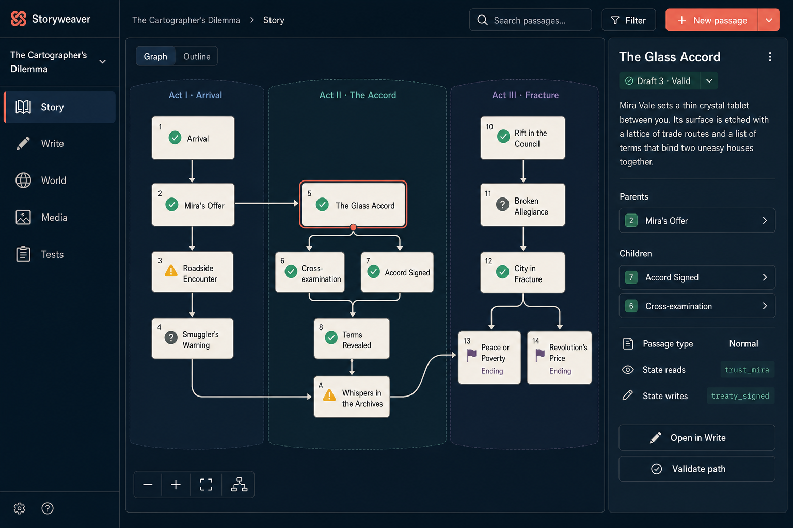

### Component inventory

- `StoryToolbar`
- `GraphOutlineToggle`
- `ArcLane`
- `PassageNode`
- `GraphEdge`
- `GraphViewportControls`
- `PassageInspector`
- `ValidationStatusBadge`

### Interaction contract

- Graph and Outline render the same selection and filters.
- Selecting a node updates the inspector without navigating away.
- Double-click or `Open in Write` navigates to authoring.
- Status icon, label, and accessible name identify committed, draft, warning,
  unresolved, and ending states.
- Filtering never mutates the graph or hide the number of omitted nodes.
- `Validate path` runs from the selected node with visible job progress.
- New passage begins with the selected node as parent but requires confirmation.
- Keyboard users can traverse nodes in logical story/outline order.

## 3. New passage plan

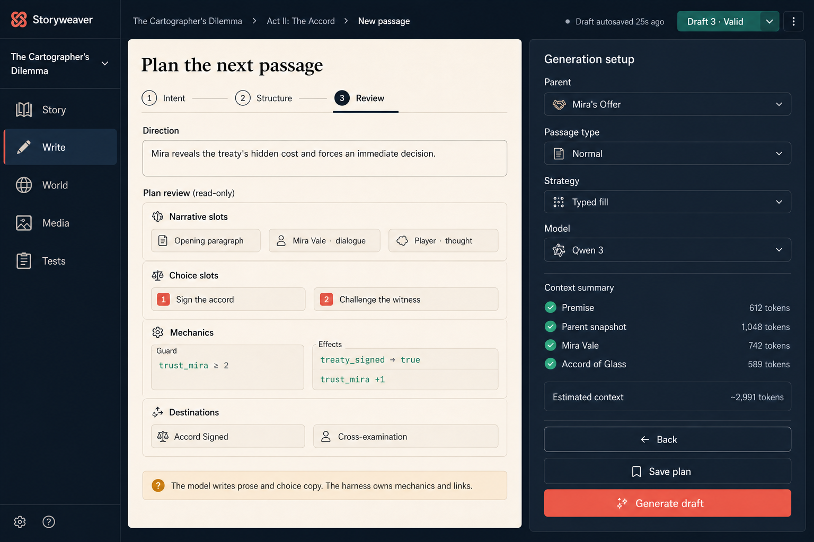

### Component inventory

- `PassagePlanStepper`
- `DirectionEditor`
- `NarrativeSlotSummary`
- `ChoiceSlotSummary`
- `MechanicSummary`
- `DestinationSummary`
- `GenerationSetupInspector`
- `ContextPackSummary`
- `TokenEstimate`

### Interaction contract

- Intent collects author direction without mechanics syntax.
- Structure chooses passage type, slots, destinations, and bounded mechanics.
- Review displays the exact immutable plan revision sent to generation.
- Locked plan fields cannot be altered from generated fill output.
- `Save plan` persists without generating.
- `Generate draft` submits plan identity, revision, strategy, and expected
  context fingerprint.
- Context entries disclose inclusion, exclusion, token estimate, and source.
- An open question or invalid component blocks generation with a field-linked
  diagnostic.

## 4. Passage mechanics

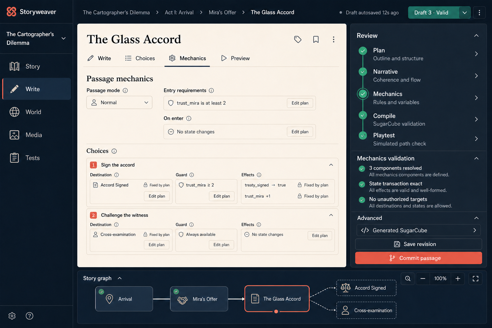

### Component inventory

- `PassageModeControl`
- `ConditionCard`
- `EffectCard`
- `ChoiceMechanicCard`
- `PlanAuthorityLock`
- `MechanicValidationPanel`
- `GeneratedSourceDisclosure`

### Interaction contract

- Human-readable conditions/effects are canonical UI; generated source is a
  disclosure.
- `Fixed by plan` fields cannot be edited in-place.
- `Edit plan` creates a new plan revision and marks incompatible draft content
  stale.
- State IDs and destinations use searchable controlled selectors.
- Unsupported operations cannot be entered as arbitrary text.
- Validation distinguishes unknown target, type mismatch, unsupported
  operation, missing required component, and unreachable destination.

## 5. Preview and playtest

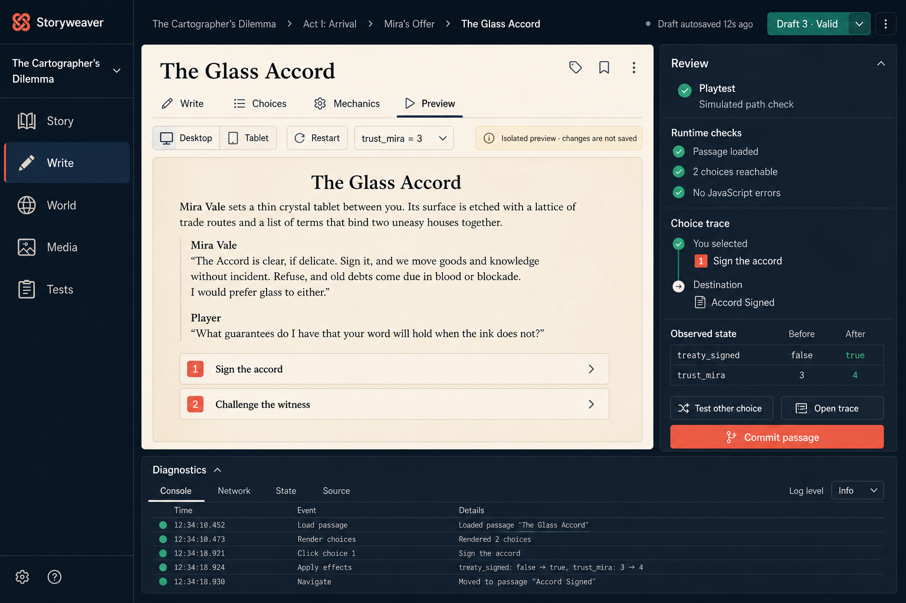

### Component inventory

- `PreviewViewport`
- `ViewportSelector`
- `StateFixtureSelector`
- `IsolatedStoryPlayer`
- `RuntimeCheckList`
- `ChoiceTrace`
- `StateBeforeAfterTable`
- `DiagnosticTimeline`

### Interaction contract

- Preview runs in an isolated session and never mutates project story state.
- State fixtures are explicit, named, and reproducible.
- Executing a choice records target, guard decision, effects, runtime errors,
  and before/after state.
- `Test other choice` resets to the same fixture before execution.
- Diagnostics remain attached to draft ID, revision, compiler version, and
  fixture fingerprint.
- A draft edit marks the preview result stale.
- Commit uses the last valid current-revision result, never a stale trace.

## 6. World continuity

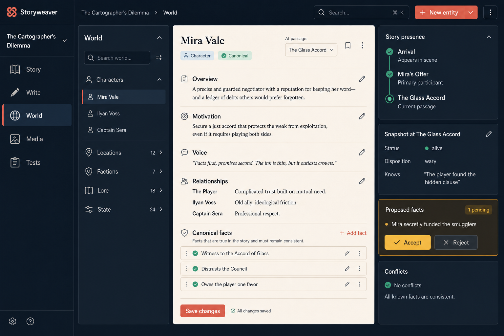

### Component inventory

- `WorldNavigator`
- `EntitySheet`
- `CanonicalFactList`
- `PassageContextSelector`
- `StoryPresenceTimeline`
- `SnapshotInspector`
- `FactProposalCard`
- `ConflictPanel`

### Interaction contract

- Canonical sheet data, passage-local snapshot, and proposals are separate
  resources and visually distinct.
- Selecting `At passage` changes snapshot/presence context without rewriting
  canonical facts.
- Accepting a proposal requires a preview of its canonical destination.
- Rejecting a proposal records disposition without deleting generation
  provenance.
- Conflicts link to both facts and affected passages.
- Save applies only authored sheet changes; proposal actions are separate.

## 7. Benchmark comparison

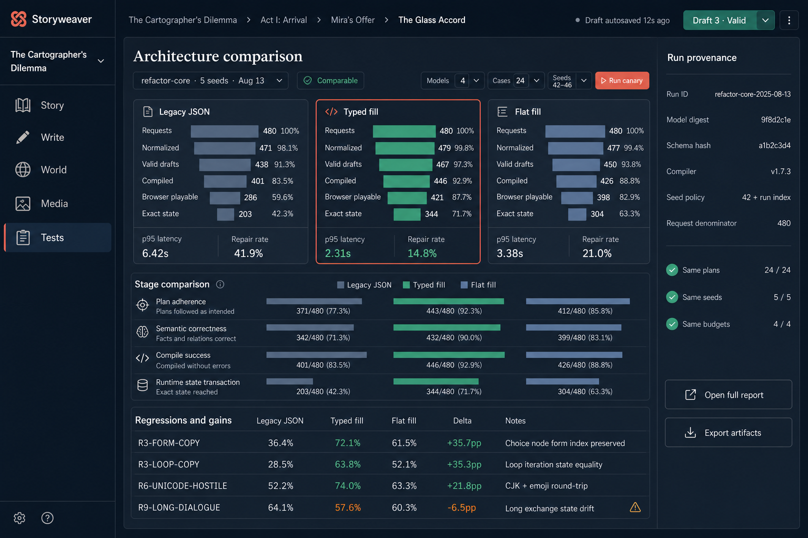

### Component inventory

- `BenchmarkRunSelector`
- `ComparabilityBadge`
- `ArchitectureFunnel`
- `StageComparison`
- `RegressionTable`
- `RunProvenanceInspector`
- `ArtifactExportActions`

### Interaction contract

- Every funnel begins at the original request denominator.
- Counts and percentages are both visible.
- Conditional rates are labeled and cannot replace request-level rates.
- Architecture columns share cases, seeds, budgets, and model fingerprints or
  the run is marked Not comparable.
- Selecting a stage filters the regression table but retains total denominators.
- Selecting a case opens per-seed artifacts and failure categories.
- The UI reads immutable result artifacts; it does not rescore silently.
- Export includes manifest, cases, prompts, raw outputs, normalized artifacts,
  results, and evaluator versions according to privacy settings.

The numbers in the visual mockup are illustrative only. They are not benchmark
claims and must not be copied into reports or promotion decisions.

## 8. Media library

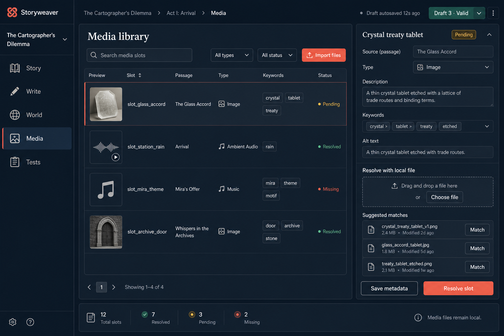

### Component inventory

- `MediaToolbar`
- `MediaSlotTable`
- `MediaPreview`
- `MediaSlotInspector`
- `KeywordEditor`
- `AltTextEditor`
- `LocalFileDropzone`
- `SuggestedMatchList`
- `MediaStatusSummary`

### Interaction contract

- A media slot is metadata until resolved to a local file.
- Search and filters operate on slots without scanning outside configured media
  roots.
- Selecting a row updates the inspector and does not change status.
- File matching previews relative destination, media type, size, and conflicts.
- `Resolve slot` validates file existence/type and updates the slot atomically.
- `Save metadata` does not imply resolution.
- Missing means a previously resolved file is unavailable; Pending means no file
  has been approved yet.
- Alt text is required for resolved visual media unless explicitly decorative.

## 9. Commit transaction review

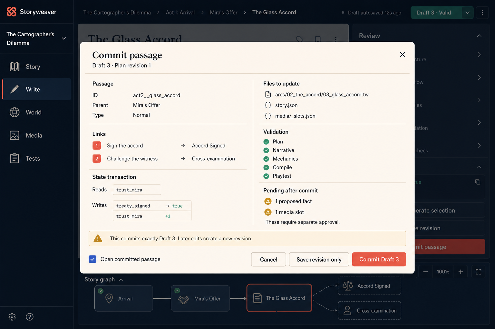

### Component inventory

- `CommitReviewDialog`
- `PassageIdentitySummary`
- `LinkTransactionSummary`
- `StateTransactionSummary`
- `FileChangeList`
- `ValidationGateSummary`
- `PendingApprovalSummary`

### Interaction contract

- The first Commit action opens this review; only `Commit Draft N` performs the
  transaction.
- Draft ID/revision, plan revision, parent fingerprint, compiler version, and
  project version are captured when the dialog opens and rechecked on submit.
- Links and state transactions are derived from the persisted `CompileArtifact`,
  not reconstructed in the browser.
- Files listed are the transaction's declared write set.
- Pending facts and media remain pending after passage commit and require
  separate actions.
- A changed validation result or revision closes the confirmation state and
  returns the author to review with a conflict diagnostic.
- While committing, the dialog cannot be dismissed accidentally; safe
  cancellation depends on transaction stage.
- Success returns the committed passage ID and version before navigation.

## 10. Stale draft conflict

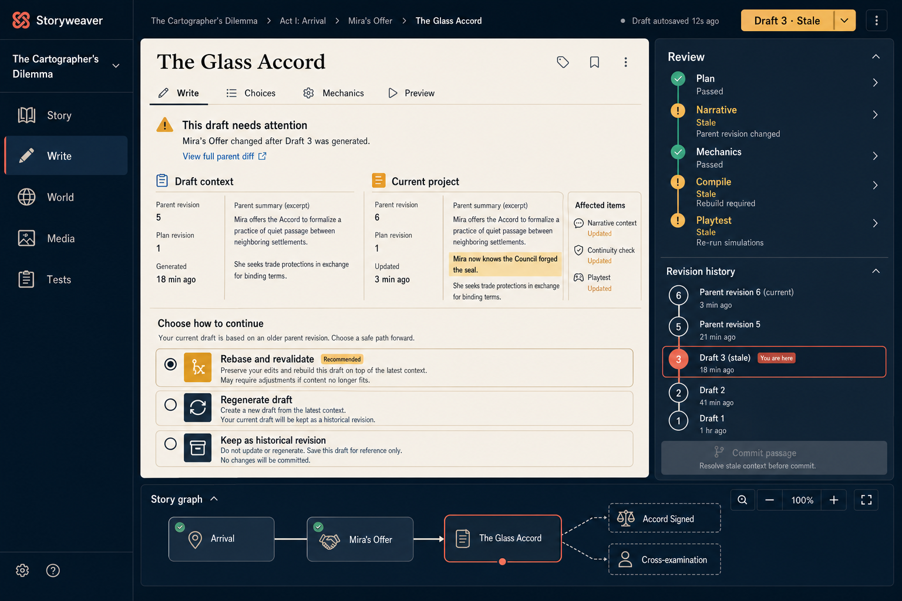

### Component inventory

- `StaleDraftBanner`
- `RevisionComparison`
- `AffectedStageList`
- `ConflictResolutionOptions`
- `RevisionHistory`
- `DisabledCommitReason`

### Interaction contract

- Stale is a server-derived lifecycle state, not a client warning heuristic.
- The comparison identifies exact expected/current parent revisions and the
  changed context fields.
- `Rebase and revalidate` preserves authored fill content where plan slots are
  still compatible, creates a new draft revision, and reruns affected stages.
- `Regenerate draft` preserves the old revision as history and creates a new
  generation request against current context.
- `Keep as historical revision` prevents commit without deleting evidence.
- The UI never offers overwrite-current-parent or ignore-conflict as a default.
- Unaffected stages remain visibly passed; dependent stages become stale rather
  than failed.

## 11. Models and generation settings

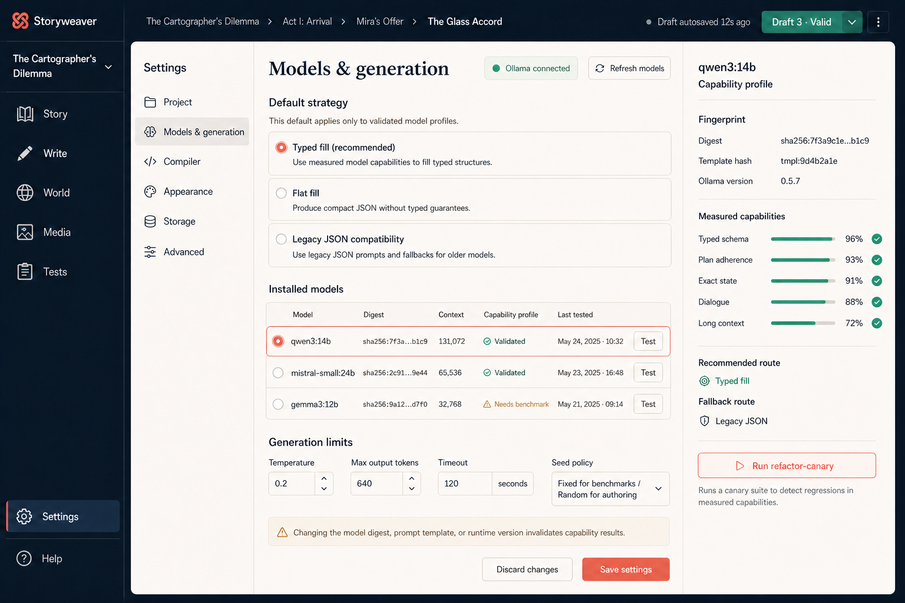

### Component inventory

- `SettingsNavigation`
- `OllamaConnectionStatus`
- `StrategySelector`
- `InstalledModelTable`
- `CapabilityProfileInspector`
- `GenerationLimitForm`
- `CapabilityInvalidationNotice`

### Interaction contract

- Installed model identity is keyed by exact digest, not display tag alone.
- A strategy can be selected globally only when the chosen model/profile
  supports it; otherwise the UI explains and applies the declared fallback.
- Capability percentages link to the compatible immutable benchmark run.
- Changing digest, chat template, ingestion profile, runtime, compiler, schema,
  or relevant limits invalidates or makes prior capability evidence
  non-comparable.
- `Run refactor-canary` creates a benchmark job with a visible selection plan
  before model calls begin.
- Authoring temperature/seed behavior is distinct from benchmark seed policy.
- Saving settings returns the effective normalized configuration and any
  invalidated capability-card IDs.

## 12. Sandbox workspace

### Component inventory

- `ExperienceModeSelector`
- `StoryGuidanceControl`
- `CharacterSimulationDepthControl`
- `WorldClockStatus`
- `TopologyMap`
- `LocationNode`
- `RouteEdge`
- `SystemStateStrip`
- `OpportunityCard`
- `LocationSandboxInspector`
- `AvailableActionList`
- `EncounterEligibilityTable`
- `SimulationActions`

### Interaction contract

- Topology describes reusable places/routes, not a start-to-ending progression.
- Sandbox defaults Story guidance to Off: no required main plot, beats, climax,
  or ending. Light guidance may suggest optional threads without forcing them.
- Topology, Visit history, and Systems are views of authored world structure and
  a selected runtime/fixture context.
- Current-player location appears only when a preview/runtime session is
  selected; it is not canonical authoring metadata.
- Opportunity cards identify provenance: player initiated, world event,
  character agenda, or authored anchor.
- Prerequisites, expiry, cooldown, occurrence limit, and possible consequence
  categories are visible before opening an encounter.
- `Open encounter` authors/previews the eligible encounter without granting the
  model authority over eligibility or effects.
- Location actions resolve through typed engine operations and show unavailable
  reasons when gated.
- Encounter-table weights apply only across currently eligible entries and are
  reproducible for a fixed state and seed.
- `Simulate 10 turns` creates a disposable job/trace using an explicit fixture
  and policy; it never changes project canon.
- A saved runtime session stores persistent world/player state and visit history
  separately from authored topology and templates.
- Characters have persistent per-session state according to the configured
  simulation depth: location, activity, stats, health/conditions, inventory,
  knowledge, relationships, needs, schedules, cooldowns, and agendas. Leaving
  and returning does not reset them.
- Character runtime state is inspectable from a location/opportunity and links
  to its canonical World sheet. Canonical identity/personality data and mutable
  session stats are never presented as one editable object.
- Character stats are project-defined typed fields with bounds and visibility;
  the UI does not assume every sandbox needs RPG combat attributes.
- Sandbox validation treats cycles/revisits as normal, requires route/action
  consistency, and reports liveness/soft-lock risk rather than demanding an
  ending.

### Mode relationship

- **Story-driven:** use the arc/branch Story map as the default.
- **Hybrid:** expose both Story anchors and Sandbox topology, with anchor events
  eligible through typed world conditions.
- **Sandbox:** use topology, systems, opportunities, and visit history as the
  default; Story guidance is Off and authored endings are optional.

Switching a project mode opens a migration preview listing validation changes,
missing topology/system requirements, and UI default changes. It does not
rewrite passages, routes, or snapshots automatically.

## 13. Sandbox experience settings

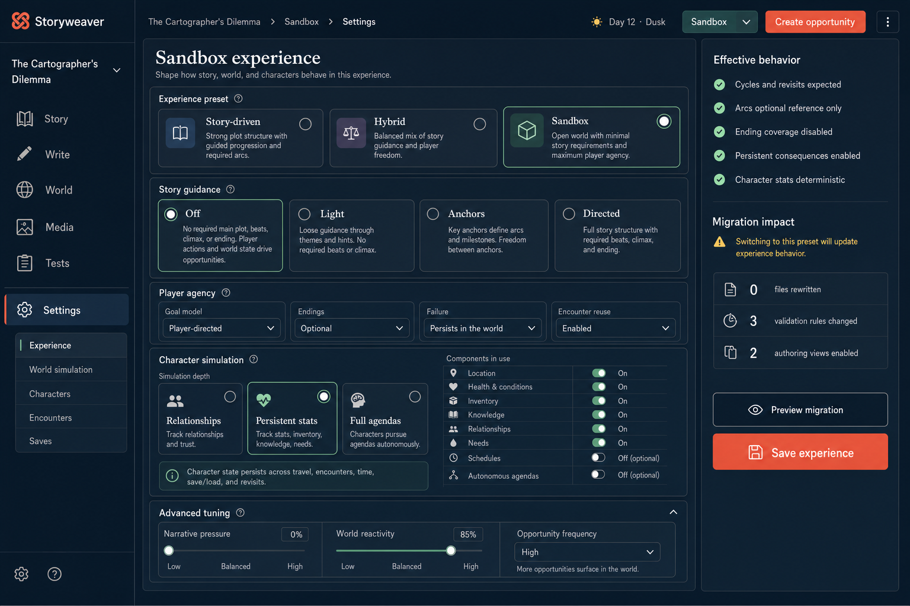

### Component inventory

- `ExperiencePresetSelector`
- `StoryGuidanceSelector`
- `PlayerAgencySettings`
- `CharacterSimulationDepthSelector`
- `CharacterSystemToggles`
- `AdvancedExperienceTuning`
- `EffectiveBehaviorSummary`
- `MigrationImpactSummary`

### Interaction contract

- Selecting Sandbox applies safe defaults but does not save immediately.
- Story guidance Off explicitly removes required main-plot, beat, climax, and
  ending pressure from planning and validation.
- Light, Anchors, and Directed change planning pressure without changing the
  underlying compiler or runtime storage.
- Character simulation depth controls which runtime systems are active:
  Relationships, Persistent stats, or Full agendas.
- Individual character systems can be enabled only when their schema and engine
  support exist; unavailable dependencies are explained.
- Persistent stats include project-defined bounded fields and may cover
  location, health/conditions, inventory, knowledge, relationships, and needs.
- Schedules and autonomous agendas are opt-in because they add simulation cost
  and require liveness/invariant validation.
- The Effective behavior panel is derived from the full normalized profile, not
  hard-coded to the selected preset label.
- Preview migration lists validation/UI/default changes and proves authored
  files will not be rewritten silently.
- Save creates a new versioned `ExperienceProfile` revision and invalidates
  incompatible plans, simulations, playtests, and benchmark capability evidence.

## Required states not pictured

Every workspace must implement these states even when not shown in the mockups:

| State | Required behavior |
|---|---|
| Loading | Skeleton matching final layout; stable dimensions; meaningful status announcement |
| Empty | Explain why empty, give one primary next action, preserve navigation |
| Partial | Render available data and identify unavailable sections independently |
| Error | Stable error code, concise explanation, retry when safe, diagnostics disclosure |
| Offline/upstream unavailable | Preserve local edits; distinguish FastAPI, Ollama, Tweego, and browser-runner availability |
| Stale | Identify changed upstream revision and offer compare/rebase/regenerate actions |
| Conflict | Show expected and actual revisions; never overwrite silently |
| Read-only | Explain permission/lifecycle reason; keep copy/export available |
| Long-running | Job progress, cancellation where safe, persistence across navigation/reload |

## Shared overlays and dialogs

The implementation also needs consistent patterns for:

- command palette;
- commit transaction review;
- unsaved-edit navigation guard;
- stale revision comparison;
- generation progress and cancellation;
- model/upstream failure details;
- file selection and import conflict;
- destructive deletion confirmation; and
- keyboard shortcut reference.

Dialogs trap focus, restore focus on close, close with Escape when safe, and
never use backdrop click as the only cancellation method.

## Source prompts

- [Initial authoring workspace prompt](greenfield-authoring-workspace.prompt.md)
- [Extended mockup set prompts](mockup-set-prompts.md)

All images were produced with the built-in image-generation workflow. The
initial authoring workspace was used as a visual-system reference for the seven
extended screens.
