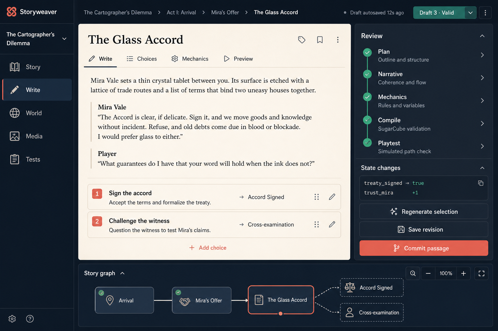
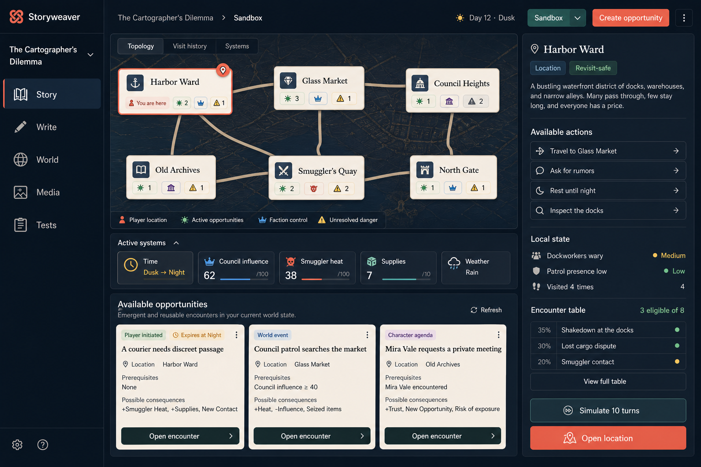

# SugarCube Harness Refactor/Rebuild Plan

## Status

- **Plan date:** 2026-08-13
- **Plan type:** Incremental production rebuild with benchmark-controlled promotion
- **Primary scope:** Passage planning, generation, normalization, deterministic SugarCube compilation, draft persistence, commit, benchmark evaluation, and a greenfield authoring UI
- **Starting point:** Preserve the current application and storage format while replacing the model-to-passage pipeline behind compatibility adapters
- **Decision:** Begin implementation after freezing a small reproducible legacy baseline. Do not wait for additional prompt-optimization experiments.

This document turns `harness-refactor-proposal.md` into an executable engineering plan. The proposal remains the architectural rationale; this plan defines implementation order, repository changes, benchmark extensions, acceptance gates, compatibility rules, and rollback points.

## 1. Outcome

Rebuild the passage-generation path so that:

1. the harness creates a trusted, versioned passage plan;
2. the model fills bounded narrative and choice-copy slots;
3. optional mechanic proposals cannot exceed plan authority;
4. deterministic code compiles the validated draft to SugarCube;
5. generation, review, editing, validation, and commit use one persisted typed artifact;
6. raw model text is retained as provenance but is never reparsed at commit time;
7. the legacy delimited and JSON paths remain usable until the typed path clears benchmark and production gates; and
8. every architecture is evaluated on the same plans, model artifacts, seeds, request budgets, and semantic outcomes.

The target production flow is:

```text
GenerateRequest
  -> ContextPack
  -> PassagePlan                    trusted harness authority
  -> generation strategy
       -> legacy adapter            compatibility
       -> typed_fill                explicit narrative AST
       -> flat_fill                 compact slot-keyed JSON
       -> typed_staged              optional later mechanic call
  -> NarrativeFill
  -> optional MechanicProposal      bounded by the plan
  -> PassageDraft                   validated assembly
  -> CompileArtifact                deterministic Twee + diagnostics
  -> DraftRecord                    immutable persisted revision
  -> human review/edit
  -> commit by draft ID + revision
  -> atomic project transaction
  -> compile/runtime validation
```

## 2. Why This Rebuild Is Supported by the Benchmarks

### 2.1 Evidence already sufficient to start

The published legacy artifact recorded 49 passes from 248 requests (19.8%). Its exact prompt treatment is no longer the current production configuration, so it must not be treated as a formal control. It is still useful failure evidence:

- JSON was the strongest transport variant at 21/32 passes (65.6%).
- Required macro behavior failed in 60/64 applicable capability cases.
- Balanced macros failed in 28/28 applicable cases.
- State-variable behavior failed in 21/32 applicable cases.
- The parser reported repeated missing `SUMMARY`, `CHOICES`, and `PROSE` sections and frequently fell back to raw prose.

These results support moving syntax and mechanics out of the default model response. They do not establish the effect size of the proposed architecture, identify a winning model, or justify changing the production default without paired measurements.

### 2.2 Existing refactor benchmark assets

The repository already contains:

- `model_benchmark/refactor_cases.json`: 24 architecture-neutral fixed-plan cases;
- `refactor-canary`: a 10-case implementation loop;
- `refactor-core`: the complete 24-case promotion cohort;
- `typed_fill`: an explicit narrative-block and inline-part AST;
- `flat_fill`: smaller slot-keyed JSON normalized to the same fill type;
- case-derived JSON schemas;
- fixed plan IDs, revisions, slots, speakers, state/entity allowlists, and required components;
- scoring for raw contract, plan adherence, fill completeness, and semantic observables; and
- repeated execution with an explicit base seed incremented per run.

The unit tests in `model_benchmark/tests/test_refactor_benchmark.py` already verify:

- corpus and canary sizes;
- rejection of ambiguous or duplicate plan authority;
- schemas constrained to known slots and references;
- prompts that expose an immutable plan rather than SugarCube authoring;
- rejection of extra slots, empty text, cross-typed references, and extra fields;
- normalization parity for `typed_fill` and `flat_fill`;
- paired architectures receiving the same seed;
- use of Ollama JSON schema; and
- one result record per original request.

This is enough to begin the production refactor. It is not enough to promote it, because the current refactor scorer ends at `RefactorFill` semantics. Its temporary `_model_output_from_fill()` adapter flattens the fill back into legacy `ModelOutput`; it does not assemble authoritative mechanics or prove compiled behavior.

### 2.3 Benchmark gaps this plan must close

Before production promotion, the benchmark must measure:

1. plan construction correctness;
2. fill/proposal-to-draft assembly;
3. exact resolved state reads and writes;
4. required mechanic-component resolution;
5. deterministic compiler success;
6. compile diagnostics and repair behavior;
7. browser passage load and choice execution;
8. continuity after multiple committed passages;
9. draft revision and commit integrity; and
10. narrative/choice quality independently of mechanical correctness.

## 3. Scope and Constraints

### In scope

- Passage generation and its prompt/context boundary.
- Typed plan, fill, mechanic, draft, compile, and diagnostic contracts.
- Legacy-to-typed adapters.
- Pure deterministic SugarCube rendering.
- Immutable draft persistence and revisions.
- Generate/review/edit/commit API changes.
- Atomic passage, graph, media-slot, and draft commit behavior.
- Benchmark architecture adapters and post-fill evaluation layers.
- UI changes necessary to review typed drafts and diagnostics.
- Migration flags, observability, and compatibility support.

### Out of scope for the first production slice

- Replacing Ollama.
- Redesigning all planning, character, lore, media, or playtest features.
- A general SugarCube parser or arbitrary user-authored SugarCube AST.
- Autonomous acceptance of new characters or lore.
- Mandatory multi-call or multi-agent generation.
- Removing human review.
- Deleting historical benchmark cases.
- Changing the project filesystem layout or `story.json` format unless a versioned migration is necessary.
- Implementing every planned future feature marker currently present in the repository.

### Engineering constraints

- Existing projects must continue to load and compile.
- Legacy `ModelOutput` records must remain readable.
- No silent configuration migration.
- The default remains legacy until the typed path passes the declared gates.
- Compiler functions must not call Ollama, read mutable global configuration, or write project files.
- Model-authored values must never determine passage IDs, file paths, arbitrary state targets, raw link targets, or unapproved mechanics.
- Benchmark results from different cohorts, seed policies, model digests, or chat templates must not be aggregated as direct comparisons.

### Experience modes

Story shape becomes an explicit project capability rather than an assumption
embedded in prompts and validation.

| Mode | Authoring model | Player experience | Structural expectation |
|---|---|---|---|
| **Story-driven** | arcs, planned beats, authored branch progression | directed dramatic choices with deliberate pacing | forward progress and endings are expected |
| **Hybrid** | authored anchor events inside reusable locations and systemic state | free exploration between major story developments | cycles are normal; selected gates advance anchors |
| **Sandbox** | world topology, reusable encounters, character agendas, factions, resources, and simulation rules | player-selected goals and emergent consequences | cycles and revisits dominate; endings are optional |

Use stable internal values `story_driven`, `hybrid`, and `sandbox`. Hybrid should
be the recommended starting point for authors who want both a main plot and
meaningful freedom. The current project behavior migrates to `story_driven` so
existing validation semantics do not change silently.

The mode is a project default, with optional explicit overrides for an arc,
region, or scenario. A local override inherits global world/state definitions
but declares its own validation profile. Changing modes runs a migration preview
and never rewrites graph structure automatically.

Mode affects:

- planning vocabulary and prompt/context assembly;
- allowed passage/encounter structures;
- whether cycles, revisits, and missing endings are errors;
- state and snapshot semantics;
- graph versus topology presentation;
- context selection for repeated visits;
- simulation and browser-test strategy;
- benchmark cohort and quality rubric; and
- UI defaults.

It must not create three unrelated compilers or storage systems. All modes use
the same typed conditions, effects, state registry, deterministic compiler,
draft revisions, and commit transaction.

## 4. Target Contracts

Create production Pydantic models rather than importing the benchmark dataclasses into `harness`. The benchmark should adapt to the production contracts once they stabilize.

### 4.1 `ExperienceProfile`

A versioned project-level contract containing:

- `mode`: `story_driven`, `hybrid`, or `sandbox`;
- `narrative_pressure`: how strongly planning prioritizes unresolved authored
  beats;
- `world_reactivity`: how frequently persistent systems create opportunities;
- `encounter_reuse`: whether and how authored encounters may recur;
- `time_model`: none, turn, phase, day, or authored clock;
- `goal_model`: authored, mixed, or player-directed;
- `ending_policy`: required, optional, or none;
- `failure_persistence`: whether setbacks alter the continuing world rather than
  forcing retry; and
- explicit region/arc overrides.

Named modes provide safe defaults. Advanced values may be tuned independently,
but the effective profile and its fingerprint are stored with every plan,
draft, benchmark request, and playtest.

### 4.2 `PassagePlan`

Trusted authority created by the harness or explicitly approved planning data.

Required fields:

- `schema_version`
- `plan_id`
- `revision`
- `passage_mode`
- narrative slots with stable IDs, kinds, and optional fixed speakers
- choice slots with stable IDs and harness-owned destinations/mechanics
- allowed state reads
- allowed entity references
- allowed effects and operations
- required mechanic components
- optional bounded mechanic slots
- context fingerprint
- effective experience-profile fingerprint
- repeatability and re-entry policy
- optional time cost, cooldown, eligibility, and expiry for sandbox encounters

The plan owns mechanics and topology. A model response cannot add or replace its slots, targets, operations, passage mode, or link destinations.

### 4.3 `NarrativeFill`

The default model-owned artifact:

- `plan_id` and `plan_revision`
- filled narrative slots
- filled choice labels and hints
- summary and beats
- bounded continuity proposals
- bounded media proposals

Initial narrative block kinds:

- paragraph
- dialogue
- thought

Initial inline part kinds:

- text
- state reference
- entity reference

Schemas should be derived from each plan. A plan with no state references must not expose a state-reference schema branch.

### 4.4 `MechanicProposal`

An optional, separately persisted artifact used only when a plan deliberately leaves a mechanic choice open. It may propose values only for known mechanic slots and allowlisted operations/targets. It cannot create new authority.

Do not put `MechanicProposal` in the first production default. Add it after one-call typed generation and deterministic compilation are working.

### 4.5 `PassageDraft`

The validated assembly of:

- the exact plan revision;
- one accepted narrative fill revision;
- zero or one accepted mechanic proposal revision; and
- resolved harness-owned mechanics.

Assembly is strict:

- every required slot appears exactly once;
- no unknown slot appears;
- fixed speaker and block kinds match;
- references and effects are allowlisted;
- all required components resolve;
- passage-mode invariants hold; and
- diagnostics are returned separately from domain data.

### 4.6 `CompileArtifact`

A pure compiler result containing:

- generated Twee source;
- exact state reads and writes;
- link targets/placeholders;
- media placeholders;
- deterministic diagnostics;
- compiler/schema version;
- source draft fingerprint; and
- optional source map from generated text to draft slots/components.

### 4.7 `DraftRecord`

Persisted under `.harness/cache` initially, with:

- generation ID;
- immutable draft revision;
- plan/fill/proposal payloads and fingerprints;
- raw model output and request metadata;
- model digest, template/ingestion profile, effective configuration, seed, tokens, latency, and finish reason;
- normalization and validation diagnostics;
- compile artifact or compile failure;
- parent passage identity and parent revision/fingerprint;
- review edits as a new revision; and
- lifecycle state: generated, edited, validated, committed, rejected, or superseded.

### 4.8 Sandbox domain contracts

Add shared production contracts rather than encoding sandbox behavior in prose:

- `WorldTopology`: locations/regions and traversable routes;
- `LocationNode`: stable place identity, local actions, tags, and encounter-table
  references;
- `Route`: source, destination, eligibility, cost, travel effects, and risks;
- `SimulationClock`: current time plus deterministic advancement rules;
- `SystemRule`: typed trigger, condition, effect, priority, and cooldown;
- `FactionState`: influence, disposition, resources, and declared relationships;
- `Opportunity`: currently eligible player-facing situation with provenance and
  expiry;
- `EncounterTemplate`: reusable plan skeleton with eligibility, cooldown,
  occurrence limits, and variation slots;
- `VisitRecord`: runtime entry/exit state, selected actions, effects, and clock;
  and
- `RuntimeSession`: persistent player/world state plus deterministic event seed
  and visit history.

The model may write narrative variation and choice copy for an eligible
encounter. It does not select arbitrary targets, advance time, mutate faction
state, determine eligibility, or bypass cooldown/occurrence limits.

### 4.9 Snapshot and revisit semantics

The current one-snapshot-per-passage model is suitable for authored forward
progress but cannot represent revisiting the same location under multiple world
states. Separate:

1. **Canonical authored facts** — stable world/entity truth;
2. **Persistent runtime state** — player, faction, resource, clock, and world
   values for one playthrough;
3. **Visit history** — ordered observations/actions/effects per entry;
4. **Authoring fixtures** — named states used to preview and test content; and
5. **Context summaries** — derived, disposable views for generation.

`PassageEntry.snapshot` remains readable for legacy/story-driven projects. New
hybrid/sandbox content references state requirements and fixture IDs rather than
claiming one snapshot is true for every visit. Migration must not copy a static
node snapshot into runtime state on every re-entry.

## 5. Proposed Module Boundaries

Add a focused package while retaining compatibility facades:

```text
harness/generation/
  __init__.py
  contracts.py          PassagePlan, NarrativeFill, MechanicProposal,
                        PassageDraft, CompileArtifact, diagnostics
  context.py            ContextPack construction and fingerprints
  planning.py           deterministic PassagePlan construction
  schemas.py            plan-derived model-facing JSON schemas
  strategies.py         legacy_json, legacy_delimited, typed_fill,
                        flat_fill, later typed_staged
  normalize.py          strategy output -> NarrativeFill/proposal
  assemble.py           authority and semantic validation -> PassageDraft
  compiler.py           pure PassageDraft -> CompileArtifact
  drafts.py             immutable draft persistence and revisions
  pipeline.py           orchestration only
  compatibility.py      ModelOutput <-> typed migration adapters
harness/simulation/
  __init__.py
  contracts.py          topology, routes, clock, systems, encounters, sessions
  eligibility.py        pure opportunity and encounter eligibility
  engine.py             deterministic action/time/system resolution
  context.py            runtime state -> generation ContextPack
  persistence.py        runtime sessions and visit history
```

Existing modules evolve as follows:

| Existing file | Planned responsibility |
|---|---|
| `harness/models.py` | Existing project/storage models; re-export typed contracts temporarily if needed |
| `harness/generators.py` | Compatibility facade and non-passage generators; delegate passage work to `generation/pipeline.py` |
| `harness/parsers.py` | Legacy adapters and salvage only; absent from normal typed commit path |
| `harness/passage.py` | Project transaction and legacy facade; rendering moves to compiler |
| `harness/audit.py` | Historical audit compatibility; draft persistence moves to `generation/drafts.py` |
| `harness/ollama_client.py` | One detailed result envelope for synchronous and asynchronous calls |
| `harness/server/app.py` | Thin request mapping; generate returns draft identity, commit consumes draft identity |
| `model_benchmark/refactor_benchmark.py` | Production-contract adapters plus layered compile/runtime scoring |

Do not split the 89 KB server module merely for cosmetic reasons during the first compiler slice. Extract generation endpoints only when their new application service exists and is covered.

## 6. Greenfield UI Rebuild

The current UI is useful proof of the product, but it is not a suitable boundary
for the rebuilt workflow. `harness/server/templates/index.html` contains roughly
3,575 lines of markup and inline JavaScript. Passage generation, parsed-output
editing, commit request construction, graph interaction, planning, media,
settings, and utility functions share one page and mutable global state.

If the interface were designed for the first time around the target typed-draft
architecture, it should treat a passage draft—not a chat response or raw JSON
blob—as the central object.

For hybrid and sandbox projects, the central Story view additionally treats the
current world/session state as a first-class object. A reusable location or
encounter template is authored and versioned like other content; an individual
runtime visit is history, not a new source passage file.

### 6.1 Product principles

1. **Writing remains central.** The largest and calmest surface is the passage
   editor, not configuration or model output.
2. **Mechanics are visible but structured.** Authors can understand and approve
   choices, guards, state changes, and destinations without editing SugarCube.
3. **Validation is progressive.** Plan, narrative, mechanics, compile, and
   playtest are distinct stages with actionable diagnostics.
4. **Draft state is explicit.** Generated, edited, valid, stale, compiling,
   committed, rejected, and superseded states are never inferred from button
   visibility.
5. **The graph provides context, not constant competition.** It remains
   available as a collapsible local path strip and a dedicated full story-map
   workspace.
6. **Advanced data is inspectable.** Raw model responses, JSON, Twee, prompts,
   and token metadata live in developer/details views rather than the primary
   editing workflow.
7. **Every destructive or irreversible transition is legible.** Commit shows
   the exact draft revision, parent, destinations, and state transaction.
8. **The UI does not alter benchmark inputs.** Presentation, telemetry, and
   review behavior are downstream of persisted generation artifacts.

### 6.2 Visual direction and mockup

The initial high-fidelity concept is stored at:



The complete visual and interaction set is indexed in
`docs/ui-mockups/README.md`. It includes the authoring workspace, full story
map, new-passage plan review, mechanics editor, playable preview and runtime
trace, world continuity, benchmark comparison, media library, commit transaction
review, stale-draft recovery, and model/capability settings. The index defines
component inventories, interaction contracts, and required loading, empty,
stale, conflict, failure, and long-running states that are not visible in the
happy-path images.

The mockup is a product-direction artifact, not a pixel-perfect implementation
contract. It proposes:

- a narrow persistent product navigation rail;
- project and story-path context across the top;
- a warm, distraction-reduced writing surface;
- first-class Write, Choices, Mechanics, and Preview views;
- a review pipeline that exposes plan, narrative, mechanics, compile, and
  playtest status;
- explicit state changes and commit action;
- a collapsible local story graph below the editor; and
- a restrained dark editorial shell with a literary prose surface.

The design intentionally avoids a chat-first layout. Model generation is an
authoring action inside the passage workspace, not the product's organizing
metaphor.

Sandbox mode has a dedicated high-fidelity workspace:



It replaces linear act lanes with location topology, current world time,
persistent systems, reusable opportunities, available player actions, local
state, and eligible encounter tables. The complete interaction contract is in
`docs/ui-mockups/README.md`.

### 6.3 Information architecture

Use five primary workspaces:

| Workspace | Purpose | Primary objects |
|---|---|---|
| **Story** | Navigate and inspect the complete branching work | arcs, passages, graph, orphan/dead-link diagnostics |
| **Write** | Plan, generate, edit, review, preview, and commit a passage | plan, draft revisions, choices, mechanics, compile artifact |
| **World** | Maintain continuity sources | characters, locations, factions, lore, state definitions, snapshots |
| **Media** | Propose, resolve, preview, and audit media slots | slots, keywords, local files, usage |
| **Tests** | Validate the story and inspect architecture benchmarks | validation runs, playtests, benchmark comparisons, regressions |

Secondary destinations:

- Project settings
- Model and capability profiles
- Build/export
- Generation history
- Help and keyboard shortcuts

At project level, a mode selector exposes Story-driven, Hybrid, and Sandbox.
It changes workspace defaults and validation language, not the underlying file
format by itself:

- Story-driven opens Story as an arc/branch graph.
- Hybrid offers Story Graph and World Topology as peer views.
- Sandbox opens Story as World Topology with Visit History and Systems views.

Do not make every operation a modal. Persistent work belongs in a workspace;
modals are reserved for short confirmations, file selection, or small creation
forms.

### 6.4 Core Write workspace

The Write workspace uses four regions.

#### A. Context header

- project name;
- arc and passage breadcrumb;
- parent passage and branch context;
- current draft revision and lifecycle status;
- autosave state;
- revision-history menu; and
- compact actions for duplicate, reject, or open advanced details.

#### B. Passage workbench

Tabs organize different representations of the same persisted draft:

1. **Write**
   - structured prose blocks;
   - visible dialogue speakers and thought blocks;
   - selection-level regenerate action;
   - continuity suggestions as reviewable annotations;
   - comments or validation anchors attached to slot IDs.
2. **Choices**
   - one card per trusted choice slot;
   - editable label and hint;
   - read-only destination identity unless the plan is explicitly revised;
   - guard/effect summary;
   - reachability status;
   - deliberate ordering controls where order is allowed.
3. **Mechanics**
   - passage mode;
   - state reads and writes;
   - conditions and effects in human language;
   - form, loop, random, hub, room, event, or dialogue-loop components;
   - clear distinction between fixed plan authority and an open proposal;
   - plan-revision action for authorized structural changes.
4. **Preview**
   - rendered playable passage where possible;
   - device width controls;
   - state-fixture selector;
   - choice execution in an isolated preview session;
   - advanced drawers for generated Twee and source mapping.

Raw JSON is available from an Advanced menu, never as the default editor.

#### C. Review inspector

The right inspector presents a stage pipeline:

```text
Plan -> Narrative -> Mechanics -> Compile -> Playtest
```

Each stage has one of these states:

- not run;
- running;
- passed;
- passed with warnings;
- failed;
- stale because an upstream revision changed; or
- unavailable because a prerequisite failed.

Selecting a stage shows:

- concise outcome;
- field/slot-linked diagnostics;
- expected versus actual details;
- responsible owner: plan, model fill, harness compiler, or runtime;
- safe next action; and
- provenance/version information in an expandable details section.

The inspector also summarizes the commit transaction:

- passage ID and parent;
- outgoing targets;
- exact state reads and writes;
- continuity changes;
- new facts awaiting separate approval;
- media slots; and
- files that will change.

`Commit passage` is enabled only for the exact valid draft revision displayed.

#### D. Local story path

A collapsible graph strip shows:

- the current passage;
- immediate ancestors;
- outgoing choices and known targets;
- unresolved planned branches; and
- validation state on nearby nodes.

Opening the full Story workspace preserves selection and viewport context.

### 6.5 New-passage workflow

The greenfield interaction sequence is:

```text
Choose parent or planned scene
  -> describe intent
  -> review harness-owned PassagePlan
  -> generate NarrativeFill
  -> review/edit slot content
  -> validate and compile automatically
  -> preview applicable states and choices
  -> save immutable revision
  -> commit exact revision
  -> approve proposed world facts separately
```

Important behavior:

- The plan summary is shown before generation for mechanic-heavy passages.
- Ordinary passages may use a compact plan summary with one-click generation.
- Regeneration targets a slot, selection, choice, or whole fill explicitly.
- A plan change creates a new plan revision and marks incompatible fill
  revisions stale.
- Editing a valid draft creates a new draft revision and reruns only affected
  validation stages.
- Navigating away never discards an unsaved edit silently.
- Committed passages are read-only until an explicit new edit revision begins.

### 6.6 Story workspace

The full Story workspace contains:

- scalable graph canvas with arc lanes or grouping;
- search by passage, character, location, state variable, or tag;
- filters for draft/committed status, passage type, validation, orphan, ending,
  and unresolved target;
- outline/list alternative for keyboard and screen-reader access;
- node side panel with summary, parents, children, snapshot, state transaction,
  media, and validation;
- creation from an existing passage or planned scene; and
- multi-select only for safe non-destructive metadata operations.

The graph must not be the only navigation representation. Every graph action
needs an equivalent list/tree action.

#### Sandbox topology variant

For `sandbox` and topology-focused `hybrid` projects, the Story workspace shows:

- locations/regions and traversable routes rather than act lanes;
- current player location only when a runtime or preview session is selected;
- faction control, opportunity count, danger, and local-state badges;
- Topology, Visit history, and Systems views;
- active clock/resources/faction/world-system strip;
- eligible opportunities grouped by player action, world event, character
  agenda, and authored anchor;
- location inspector with available actions and encounter-table eligibility;
- simulation controls using explicit fixtures/seeds; and
- optional anchor-story overlay for Hybrid mode.

A location can be opened for authoring without creating a new visit. Simulating
turns creates a disposable or explicitly saved runtime trace, never project
canon automatically.

### 6.7 World workspace

Use a master-detail layout:

- left: searchable entity list grouped by characters, locations, factions,
  lore, and state;
- center: structured sheet plus prose notes;
- right: references, appearances, relationships, keywords, and validation.

Continuity views should distinguish:

- authored canonical facts;
- snapshot state at a selected passage;
- model-proposed facts awaiting approval; and
- conflicts or counterfactual branch-sensitive facts.

### 6.8 Tests workspace

The Tests workspace unifies story validation without conflating different test
types.

Views:

1. **Story health** — graph, state, media, and compile validation.
2. **Playtests** — path runs, coverage, endings, runtime errors, and captured
   screenshots/traces.
3. **Model benchmark** — `refactor-canary`, `refactor-core`, and historical
   profiles.
4. **Architecture comparison** — matched results for legacy and typed paths.

The architecture comparison renders a stage funnel per architecture:

```text
Requests
  -> normalized fills
  -> valid drafts
  -> compiled passages
  -> browser-playable passages
  -> exact state transactions
```

It must show counts and denominators beside percentages, seed/model fingerprints,
latency/tokens, repair rate, per-case regressions, and narrative-quality results.
The UI reads immutable benchmark artifacts; it never recalculates or hides
failed requests client-side.

Sandbox projects add:

- topology reachability and route-lock validation;
- opportunity starvation and encounter-frequency analysis;
- deterministic simulation traces;
- invariant and resource-bound checks;
- action availability coverage by location/state/time;
- faction/character agenda progression;
- cycle/revisit behavior; and
- multi-turn liveness metrics rather than ending coverage alone.

### 6.9 Frontend architecture

For a genuine greenfield implementation, use:

- **TypeScript** for API and state contracts;
- **Vite** for a small, explicit frontend build;
- **React** for the workspace/component model;
- the existing graph library initially, wrapped behind a `StoryGraphView`
  adapter so it can be replaced independently;
- browser `fetch` behind a typed `ApiClient`;
- a server-state cache such as TanStack Query for request lifecycle,
  invalidation, and optimistic-safe reads;
- a small local UI store only for selection, panel layout, and unsaved editor
  state; and
- CSS variables and component-scoped styles for tokens and layout.

Do not adopt a full design-system dependency or rich-text editor in the first
slice. Begin with accessible controlled textareas/content-editable blocks behind
an editor adapter. Add a richer editor only after copy/paste, selection-level
regeneration, undo, and accessibility requirements are tested.

The FastAPI service should serve the built frontend bundle in production while
Vite provides the development server. API routes remain under `/api`.

Suggested frontend structure:

```text
ui/
  package.json
  vite.config.ts
  src/
    app/
      App.tsx
      routes.tsx
      shell/
    api/
      client.ts
      contracts.ts
      queries.ts
    features/
      story/
      write/
      world/
      media/
      tests/
      settings/
    components/
      Button/
      Status/
      Inspector/
      SplitPane/
      EmptyState/
    state/
      workspace.ts
      draftEdits.ts
    styles/
      tokens.css
      reset.css
      app.css
    test/
```

Generated API schemas should be derived from the backend OpenAPI document or a
shared schema generation step. Handwritten TypeScript types must not drift from
Pydantic contracts unnoticed.

### 6.10 Client state model

Keep three categories separate:

| State category | Examples | Owner |
|---|---|---|
| Server truth | graph, plan, draft revisions, compile artifact, validation | query cache; refreshed from API |
| Unsaved author edits | prose block text, choice copy, current selection | draft edit store with dirty tracking |
| Ephemeral UI | open panels, graph viewport, active tab, dialog state | local component/workspace store |

Never keep a second mutable copy of the entire story graph in the browser.
Mutations return updated version/fingerprint data and invalidate focused queries.

Represent the draft lifecycle as an explicit state machine:

```text
empty
  -> generating
  -> generated
  -> edited
  -> validating
  -> valid | invalid
  -> committing
  -> committed

generated | edited | valid | invalid
  -> stale
  -> superseded | rejected
```

Impossible transitions should be rejected by both the UI and API.

### 6.11 API requirements for the new UI

Prefer resource-oriented endpoints:

```text
POST   /api/generations
GET    /api/generations/{generation_id}

GET    /api/plans/{plan_id}/revisions/{revision}
POST   /api/plans
POST   /api/plans/{plan_id}/revisions

GET    /api/drafts/{draft_id}
POST   /api/drafts/{draft_id}/revisions
POST   /api/drafts/{draft_id}/validate
POST   /api/drafts/{draft_id}/compile
POST   /api/drafts/{draft_id}/playtest
POST   /api/drafts/{draft_id}/commit
POST   /api/drafts/{draft_id}/reject

GET    /api/benchmarks/runs
GET    /api/benchmarks/runs/{run_id}
GET    /api/benchmarks/runs/{run_id}/comparison

GET    /api/experience-profile
POST   /api/experience-profile/revisions

GET    /api/topology
POST   /api/topology/locations
POST   /api/topology/routes
GET    /api/systems
GET    /api/encounters
POST   /api/simulations
GET    /api/simulations/{simulation_id}
POST   /api/simulations/{simulation_id}/actions
```

Mutation requests include expected revision/fingerprint fields. Responses use
stable error codes and field/slot diagnostic paths. Long operations expose a
job ID or stream status events so the page does not infer progress from a
disabled button.

### 6.12 Visual system

The mockup establishes a direction rather than final branding:

- deep ink/navy application shell;
- warm neutral writing canvas;
- slate inspector surfaces;
- teal for valid/success;
- amber for warnings and stale state;
- coral for the primary commit action and current graph selection;
- modern sans-serif UI typography;
- literary serif only for player-facing prose; and
- an 8 px spacing rhythm with limited elevation.

Create semantic tokens rather than hard-coded component colors:

```text
surface.app
surface.editor
surface.panel
text.primary
text.muted
border.default
status.valid
status.warning
status.error
action.primary
focus.ring
```

Support light/dark shell variants later only if the token system makes it cheap.
Do not delay the first workflow for theme customization.

### 6.13 Accessibility and keyboard behavior

Required from the first slice:

- WCAG 2.2 AA contrast targets;
- complete keyboard navigation;
- visible focus treatment;
- semantic headings, landmarks, forms, tabs, and dialogs;
- no status communicated by color alone;
- live-region announcements for generation, validation, compile, and commit;
- reduced-motion support;
- resizable panes that remain usable at 200% zoom;
- graph alternative as an accessible outline/list;
- keyboard-safe drag/drop alternatives; and
- logical focus restoration after dialogs and asynchronous actions.

Suggested shortcuts:

- `Ctrl/Cmd+Enter`: generate or run the context-appropriate primary authoring
  action, never commit;
- `Ctrl/Cmd+S`: save a draft revision;
- `Ctrl/Cmd+Shift+Enter`: validate and preview;
- `Ctrl/Cmd+K`: command palette;
- `G then S/W/O/M/T`: navigate to Story, Write, World, Media, or Tests; and
- explicit confirmation shortcut for commit only when focus is inside the
  commit review panel.

### 6.14 Responsive behavior

The product is desktop-first but should remain functional on smaller screens:

- **Wide desktop:** editor, inspector, and local graph visible together.
- **Standard laptop:** editor plus inspector; graph collapses to a drawer.
- **Tablet:** single primary pane with inspector and graph as full-height
  overlays.
- **Phone:** reading, review, quick edits, and status only; complex graph and
  mechanic authoring may direct the user to a wider viewport without blocking
  safe operations.

Persist pane widths and collapsed state locally per device, not in project data.

### 6.15 UI testing strategy

#### Component tests

- draft and validation status rendering;
- choice and mechanic editors;
- dirty-state and revision-conflict behavior;
- diagnostic paths focusing the correct slot;
- disabled/allowed lifecycle actions;
- API error normalization;
- accessible names, roles, and keyboard behavior; and
- benchmark funnel counts and denominators.

#### Contract tests

- generated TypeScript/Pydantic schema compatibility;
- representative API response fixtures;
- unknown diagnostic codes render safely;
- older readable draft versions use compatibility adapters; and
- mutation requests always include expected revisions.

#### Playwright workflows

- create a passage from a parent;
- inspect and approve a plan;
- generate a typed fill;
- edit one narrative slot and one choice;
- observe selective validation invalidation;
- preview both sides of a guarded choice;
- save a revision and recover it after reload;
- reject stale commit after a parent change;
- commit the exact valid revision;
- approve/reject proposed facts independently;
- navigate the graph and accessible outline to the committed passage; and
- inspect a matched benchmark comparison without losing failed requests.

Visual regression tests should cover the application shell, Write workspace,
diagnostic failures, narrow laptop layout, and high-zoom layout. Use them for
layout stability, not as a substitute for behavioral assertions.

### 6.16 UI delivery plan

Build the new UI beside the existing page and switch with a development/config
flag until feature parity is deliberate.

#### UI Phase A — Foundation

- Create the TypeScript/Vite application and design tokens.
- Add typed API client generation.
- Implement application shell, navigation, error boundary, notifications, and
  keyboard foundation.
- Read existing graph/project endpoints without mutations.

#### UI Phase B — Read-only workspaces

- Story graph plus accessible outline.
- Passage reader and metadata inspector.
- World and media read-only views.
- Validation and benchmark run viewers.

#### UI Phase C — Typed Write workflow

- PassagePlan review.
- Draft generation and lifecycle state machine.
- Write, Choices, Mechanics, and Preview tabs.
- Review inspector and diagnostic navigation.
- Revision save/reload.

#### UI Phase D — Commit and recovery

- Exact-revision commit review.
- Stale/conflict handling.
- Pending fact approval.
- Transaction failure and recovery presentation.
- Full Playwright workflow coverage.

#### UI Phase E — Remaining authoring parity

- Planning and arc tools.
- Experience-profile settings and migration preview.
- Sandbox topology, systems, encounter tables, opportunities, and simulation
  traces.
- Character/lore editing.
- Media import and resolution.
- Settings and model management.
- Project initialization flow.

#### UI Phase F — Cutover

- Run both interfaces against the same API during acceptance.
- Complete accessibility review and keyboard audit.
- Confirm no endpoint relies on old page globals or request shapes.
- Make the new UI default behind a reversible configuration switch.
- Keep the legacy page for one release window, then remove it after migration
  evidence is complete.

### 6.17 UI acceptance gates

The new UI can replace the existing interface when:

- all supported passage types can be reviewed and committed without raw JSON;
- the generate/edit/validate/preview/commit Playwright workflow passes;
- stale or invalid revisions cannot be committed through UI or API;
- every graph-only action has an accessible alternative;
- keyboard-only use covers the core authoring workflow;
- browser reload does not lose persisted revisions or silently discard dirty
  edits;
- benchmark views preserve original-request denominators and provenance;
- Story-driven, Hybrid, and Sandbox projects expose the correct topology,
  validation, planning, and playtest language without switching storage engines;
- sandbox simulations cannot mutate authored canon unless an explicit authoring
  action imports an approved result;
- old and new UIs produce the same backend draft/commit artifacts for matched
  compatibility fixtures; and
- rollback to the legacy UI requires configuration only.

### 6.18 Relationship to the backend rebuild

The UI and backend should not be implemented as one indivisible rewrite:

```text
UI foundation and read-only shell
  ||
backend contracts and pure compiler
  -> stable draft API
  -> typed Write workspace
  -> commit/recovery UI
  -> browser workflow gates
  -> coordinated default promotion
```

The visual shell can begin early, but mutable authoring must wait for stable
plan/draft revision contracts. The backend can run typed generation in shadow
mode before the new UI is ready. This preserves independent rollback and keeps
benchmark comparisons focused on generation architecture rather than frontend
implementation.

## 7. Work Plan

### Phase 0 — Freeze Measurement and Reproducibility

#### Goal

Create a trustworthy comparison point without spending another optimization cycle on legacy prompts.

#### Work

1. Freeze the existing 24 `refactor-core` case definitions and record a corpus content hash.
2. Add an explicit `legacy_json` architecture adapter that receives the same trusted case plan and request budget as `typed_fill` and `flat_fill`.
3. Decide the production candidate models by exact Ollama digest rather than display name alone.
4. Run a cheap baseline:
   - one representative model;
   - `refactor-canary`;
   - `legacy_json`, `typed_fill`, and `flat_fill`;
   - three seeds beginning at 42.
5. Run the formal pre-change screen when resources permit:
   - all supported model artifacts;
   - `refactor-core`;
   - the architectures that will be compared after Phase 2;
   - five fixed seeds beginning at 42.
6. Persist rendered prompt, schema hash, model digest, quantization, chat-template/ingestion-profile hash, effective options, token counts, finish reason, latency, and errors.
7. Store a machine-readable run manifest and mark the baseline immutable.

#### Benchmark rule

One original generation request equals one result record. Repairs and fallback attempts are attributes of that record, not additional successes or denominators.

#### Exit gate

- Frozen case and configuration hashes exist.
- The same-seed architecture pairing is verified.
- Missing provenance fields are visible rather than silently recorded as zero.
- Baseline results can be reproduced or their replay variance is measured.

#### Rollback point

No production behavior changes in this phase.

### Phase 1 — Production Contracts and Legacy Compiler Parity

#### Goal

Create the typed domain boundary and a pure compiler without changing emitted passages.

#### Work

1. Add the production contracts in `harness/generation/contracts.py`.
2. Add `ExperienceProfile` with safe Story-driven, Hybrid, and Sandbox defaults;
   load legacy projects as Story-driven without rewriting them.
3. Implement deterministic plan constructors for:
   - ordinary passages;
   - state reference plus fixed scene effect;
   - guarded choices;
   - forms; and
   - the passage types already rendered by `harness/passage.py`.
4. Extract `_render_passage_tw` and its helpers into a pure compiler.
5. Build `ModelOutput -> PassageDraft` compatibility conversion.
6. Compile legacy drafts through the new compiler.
7. Keep `create_passage()` behavior and signature behind an adapter until all callers migrate.
8. Return typed diagnostics instead of placing parser/compiler warnings inside domain content.

#### Deterministic tests

- Pydantic validation and version round trips for every contract.
- Duplicate, missing, unknown, wrong-kind, wrong-speaker, stale-plan, and unauthorized-reference rejection.
- Exact legacy byte parity for normal, conditional, event, random event, random, hub, room, dialogue, loop, form, and ending passages.
- Exact state read/write sets.
- Escaping for quotes, backslashes, closing macro text, `</script>`, link delimiters, HTML, Unicode, and newlines.
- Compiler determinism: identical draft and compiler version produce identical bytes and fingerprints.
- No project or network access from compiler tests.

#### Benchmark extensions

Add post-fill stages to result records:

- `draft_assembly`
- `required_component_resolution`
- `state_transaction`
- `compile_success`

For Phase 1, these stages can use fixture fills and the legacy adapter; no live model run is required.

#### Case traceability

Use the existing cases as compiler acceptance fixtures:

| Benchmark case | Required production proof |
|---|---|
| `R0-ORDINARY-*` | paragraph and choice compilation |
| `R1-STATE-REFERENCE` | typed state interpolation, fixed decrement, fixed guard |
| `R1-ENTITY-REFERENCE` | safe entity reference rendering |
| `R2-DIALOGUE-THOUGHT` | distinct dialogue/thought presentation without private labels |
| `R2-GUARDED-CHOICES` | harness-owned conditional choice |
| `R3-FORM-COPY` | textbox, listbox, and submit behavior |
| `R3-LOOP-COPY` | iteration and capture behavior |
| `R3-HUB-COPY` | visited-choice hiding |
| `R3-ROOM-COPY` | fixed exits plus local choices |
| `R3-RANDOM-COPY` | deterministic weighted-branch source generation |
| `R4-ENDING-COPY` | terminal semantics and restart target |
| `R5-TWO-STATE-REFERENCES` | multiple reads and fixed choice effect |
| `R5-FIXED-SWITCH-COPY` | fixed branch switch |
| `R6-UNICODE-HOSTILE` | escaping and Unicode preservation |
| `R8-CONTINUITY-COUNTERFACTUAL` | typed false precondition and consistent copy |
| `R9-LONG-DIALOGUE` | dialogue-loop exit/non-exit behavior |

#### Exit gate

- Existing deterministic harness tests pass.
- All supported legacy passage fixtures compile byte-for-byte identically through the compatibility adapter, except documented intentional fixes.
- Every semantically accepted fixture draft compiles.
- Compiler state transactions match the plan exactly.

#### Rollback point

The legacy adapter can continue calling the old renderer until parity is complete.

### Phase 2 — Typed Generation in Shadow Mode

#### Goal

Exercise production `typed_fill` and `flat_fill` without changing user-visible defaults.

#### Work

1. Move or adapt the benchmark schemas into `harness/generation/schemas.py`.
2. Generate schemas from production `PassagePlan` objects.
3. Implement both candidate strategies:
   - `typed_fill`: explicit blocks and inline parts;
   - `flat_fill`: slot-keyed strings with deterministic typed-reference markers.
4. Normalize both into production `NarrativeFill`.
5. Assemble and compile both through the same validator/compiler.
6. Add `generation_strategy` configuration with the legacy strategy still default.
7. Add a shadow option that records typed results without exposing or committing them.
8. Use one detailed Ollama response envelope in both benchmark and application paths.
9. Disable whole-passage repair for typed shadow evaluation initially; measure the unassisted path first. Later repair experiments must be separate architecture labels.

#### Benchmark execution sequence

During implementation:

```bash
uv run python -m model_benchmark.cli run \
  --profile refactor-canary \
  --architectures typed_fill flat_fill \
  --models MODEL \
  --runs 3 --seed 42
```

Before selecting a fill architecture:

```bash
uv run python -m model_benchmark.cli run \
  --profile refactor-core \
  --architectures legacy_json typed_fill flat_fill \
  --models MODEL \
  --runs 5 --seed 42
```

`legacy_json` must be implemented before using the second command. Until then, `typed_fill` versus `flat_fill` selects a candidate structure but does not establish improvement over production.

#### Metrics

Report per architecture and over all original requests:

- raw JSON validity;
- plan adherence;
- fill completeness;
- semantic observables;
- draft assembly;
- required component resolution;
- exact state transaction;
- compile success;
- calls and repairs per request;
- input/output tokens;
- time to first completed fill and total latency; and
- error/failure category.

Do not collapse these into one score for promotion decisions.

#### Exit gate

- A candidate typed strategy improves normalized handoff or semantic correctness over `legacy_json` beyond measured replay noise.
- Semantically accepted typed drafts compile at 100%.
- No unauthorized plan mutation reaches the compiler.
- Narrative review finds no material degradation requiring a contract redesign.

#### Rollback point

Disable shadow generation; the production UI and commit route remain legacy.

### Phase 3 — Browser and Multi-Passage Behavioral Gates

#### Goal

Prove that compiled output behaves correctly, rather than treating source inspection as gameplay validation.

#### Work

1. Extend refactor results with a compile/run evaluator.
2. Build the smallest complete story fixture around each applicable case.
3. Compile it with Tweego.
4. Load it in Playwright.
5. Assert observable behavior after executing choices and inputs.
6. Add multi-passage continuity walks for state, snapshots, and return paths.

#### Required browser assertions

- Passage loads without JavaScript/runtime errors.
- Expected text, dialogue, and thought blocks are visible.
- Every visible choice reaches the harness-owned target.
- Guarded choices show/hide correctly under both relevant states.
- Choice effects update exactly the intended state values.
- Forms bind and submit the intended variables.
- Loops render one choice per item and capture the clicked item.
- Random routes select only allowed outcomes; seeded behavior is reproducible where configured.
- Hub revisit behavior is correct.
- Room exits and local actions do not conflict.
- Ending/restart behavior returns to the expected start state.
- Hostile/Unicode text renders as text and does not execute.

For Hybrid/Sandbox fixtures also assert:

- revisiting a location preserves persistent runtime state and creates a new
  visit record rather than overwriting authored data;
- time and resource costs apply exactly once per action;
- encounter eligibility, weights, cooldowns, occurrence limits, and expiry are
  deterministic for a fixed state/seed;
- unavailable actions remain unavailable for the correct reason;
- world/faction/character systems preserve declared invariants across long
  cyclic runs; and
- player-directed loops do not require reaching an ending to count as healthy.

#### Benchmark scoring additions

- `tweego_compile`
- `browser_load`
- `choice_reachability`
- `choice_effect_execution`
- `runtime_state_transaction`
- `continuity_after_navigation`

Report browser rates twice:

1. over every original generation request; and
2. among successfully compiled drafts as a compiler/runtime diagnostic.

#### Exit gate

- Browser playability among compiled drafts is at least 95%.
- Any compiler-originated runtime failure is a release blocker.
- Request-level browser-playable rate improves over the matched legacy control.
- Exact runtime state transactions reach at least 90% of applicable original requests before promotion.

### Phase 4 — Immutable Draft Product Boundary

#### Goal

Make the validated draft, rather than raw model output, the artifact reviewed and committed by the product.

#### Current defect being removed

`/api/generate` parses according to configured output format and persists its parsed result. `/api/commit` currently accepts `raw_output` and, without `override_parsed`, reparses it with the legacy delimited parser. A JSON draft can therefore be interpreted differently during generation and commit.

#### Work

1. Add `DraftStore` with atomic writes and immutable revisions.
2. Make `/api/generate` return:
   - generation ID;
   - plan ID/revision;
   - draft ID/revision;
   - structured draft;
   - diagnostics; and
   - preview compile artifact.
3. Make human edits create a new draft revision validated against the same plan.
4. Change `/api/commit` to require draft ID, draft revision, plan revision, and expected parent fingerprint.
5. Reject stale, missing, superseded, already committed, or parent-mismatched drafts with stable conflict diagnostics.
6. Commit the exact persisted draft revision; never reparse raw output.
7. Validate and stage all filesystem changes before replacement.
8. Record commit linkage in the draft record and audit log.
9. Keep a versioned legacy commit endpoint or compatibility request shape behind an explicit flag during migration.

#### Atomic transaction scope

The transaction must cover:

- new `.tw` passage file;
- parent link update;
- `story.json` update;
- media slots;
- session pointer if changed;
- draft committed status; and
- any other derived manifest updated by passage creation.

If full filesystem transactionality is impractical, implement staged files plus a transaction journal and deterministic recovery. A partially linked graph is not an acceptable successful commit.

#### Tests

- Generate JSON draft then commit identical parsed content.
- Edited revision commits; superseded revision conflicts.
- Parent changes after generation cause a conflict.
- Duplicate commit is idempotent or returns a stable conflict without duplicate files.
- Failure injected at each write step restores or recovers the prior project state.
- Restart between generation and commit preserves the draft.
- Raw-output tampering cannot change the persisted draft.
- Legacy projects and audit records still load.

#### Exit gate

- Generate-review-edit-commit uses one typed artifact end to end.
- No normal commit route calls `parse_model_output()` or `parse_model_output_json()`.
- All failure-injection tests leave the project recoverable and internally consistent.
- Typed mode is still opt-in until the final promotion benchmark.

### Phase 5 — Staged Mechanics and Bounded Repair

#### Goal

Add complexity only where measurement shows that the one-call fill cannot reliably provide an approved open mechanic decision.

#### Work

1. Add bounded mechanic slots to plans.
2. Add separately persisted `MechanicProposal` generation.
3. Assemble proposals only when all slot, operation, target, and type checks pass.
4. Add field-local repair for schema or semantic failures.
5. Never regenerate accepted narrative merely to repair one mechanic field.
6. Add a `typed_staged` benchmark architecture.
7. Track fill latency and mechanic-stage latency separately.

#### Repair policy

- Deterministic normalization may trim whitespace, normalize safe IDs, and derive a missing summary from existing prose.
- It must not invent missing choices, state effects, references, or mechanic components.
- Schema repair is bounded to the invalid field or proposal.
- Narrative-quality concerns return to human review or explicit regeneration.
- Every repair attempt, token cost, and result remains attached to the original request record.

#### Exit gate

- `typed_staged` materially improves applicable complex-mechanic success over one-call typed generation.
- The improvement justifies added p95 latency and call count.
- Repair-induced regressions are measured and below a declared threshold.

#### Rollback point

Keep one-call typed generation as the default typed strategy.

### Phase 6 — Capability Routing and Default Promotion

#### Goal

Select strategies from measured capability and promote the typed path safely.

#### Work

1. Create capability cards keyed by:
   - exact model digest;
   - quantization;
   - chat-template or ingestion-profile hash;
   - Ollama/runtime version;
   - schema/compiler version; and
   - relevant generation settings.
2. Invalidate cards when any fingerprint changes.
3. Route only among supported strategies with recent compatible evidence.
4. Run the five-seed promotion screen across all supported model artifacts.
5. Confirm successful candidates with ten seeds.
6. Change the default through an explicit config-version migration.
7. Retain a visible legacy fallback and rollback switch for at least one release cycle.

#### Promotion gates

The typed default may be promoted only when all are true on matched `refactor-core` requests:

- semantically accepted typed drafts compile at 100%;
- normalized handoff succeeds for at least 90% of original requests;
- exact state transactions succeed for at least 90% of applicable original requests;
- browser playability among compiled drafts is at least 95%;
- request-level playable output exceeds legacy by a predeclared margin larger than the measured same-seed noise floor;
- narrative and choice quality do not regress beyond a predeclared tolerance;
- fill-stage p95 latency remains within 25% of legacy, unless an explicitly accepted quality/latency trade-off replaces this threshold;
- errors, repairs, rejected outputs, and compile failures remain in the original-request denominator; and
- results reproduce in the ten-seed confirmation run.

#### Exit gate

- Typed generation becomes the default for validated profiles.
- Legacy remains explicitly selectable.
- Rollback requires configuration only, not a code revert.

### Phase 7 — Legacy Retirement and Cleanup

#### Goal

Remove duplicate production behavior only after compatibility evidence and a stable release window.

#### Work

1. Freeze delimited, full, and thinking prompts as historical/research fixtures.
2. Remove raw-output reparsing from all commit paths.
3. Keep legacy readers for stored drafts and projects.
4. Remove dead compatibility code only after usage telemetry/audit confirms it is no longer required.
5. Retain direct-SugarCube benchmark cases in the `full` profile as historical diagnostics.
6. Keep `refactor-core` frozen for architecture comparisons; version a new cohort rather than silently editing it.
7. Update README, migration notes, API documentation, and configuration examples.

#### Exit gate

- No supported production feature requires model-authored SugarCube syntax.
- Existing projects compile identically or have an explicit versioned migration.
- Historical results remain readable and attributable to their original contract.

### Phase 8 — Hybrid and Sandbox Simulation

#### Goal

Add systemic, revisit-heavy authoring without weakening typed authority or
forcing sandbox behavior into a static branching-story abstraction.

#### Work

1. Implement the pure simulation contracts and engine under
   `harness/simulation`.
2. Add topology/location/route authoring and validation.
3. Add typed time, resource, faction, agenda, trigger, cooldown, and occurrence
   rules.
4. Add reusable `EncounterTemplate` planning and generation through the same
   NarrativeFill/PassageDraft/compiler pipeline.
5. Add runtime session and visit-history persistence separate from authored
   `story.json` truth.
6. Add fixture-driven simulation, opportunity eligibility, and trace export.
7. Add Story-driven, Hybrid, and Sandbox project presets plus migration preview.
8. Implement the sandbox UI workspace and Hybrid anchor overlay.
9. Add sandbox-specific benchmark cases and long-run invariant/property tests.

#### Deterministic ownership

The engine owns:

- action eligibility;
- route availability and cost;
- time advancement;
- resource bounds;
- faction/system transitions;
- encounter selection from eligible weighted tables;
- cooldowns and occurrence limits;
- persistent consequences; and
- seed/replay behavior.

The model owns only prose and bounded choice copy for the already selected
eligible situation, plus separately reviewed proposals where a plan exposes an
open slot.

#### Validation profiles

| Check | Story-driven | Hybrid | Sandbox |
|---|---|---|---|
| Orphan authored passage | error | error for anchors, warning otherwise | not applicable to reusable encounters |
| Unresolved link/route | error | error | error |
| Reachable ending | expected/error by policy | at least one anchor resolution if configured | optional |
| Graph cycle | allowed with intent | normal | expected |
| Revisit safety | selected passage types | required for reusable locations/encounters | required |
| Opportunity availability | optional | minimum coverage by region/state | liveness gate |
| Resource/system bounds | mechanics-specific | required for enabled systems | required |
| Long-run invariant | diagnostic | gate for enabled systems | promotion gate |

#### Exit gate

- The same fixed state/seed/action sequence produces the same trace.
- Authored project files remain unchanged during disposable simulation.
- Revisit and occurrence semantics pass deterministic and browser tests.
- Sandbox liveness and invariants pass across declared long-run fixtures.
- Hybrid anchor progression works without disabling free exploration.
- Existing Story-driven projects behave identically under the explicit profile.

#### Rollback point

Keep `story_driven` as the supported default and hide Hybrid/Sandbox project
creation if simulation gates are not satisfied. No legacy/compiler rollback is
required.

## 8. Benchmark Design and Governance

### 8.1 Cohort roles

| Cohort | Role | Promotion use |
|---|---|---|
| `canary` | Historical mixed direct-generation smoke tests | No |
| `core` | Transitional direct-generation plus harness-contract coverage | No architecture promotion |
| `full` | Historical, stress, and scorer diagnostics | No |
| `refactor-canary` | Fast fixed-plan architecture development loop | Early rejection only |
| `refactor-core` | Frozen 24-case fixed-plan comparison | Yes |
| `sandbox-canary` | Fast topology, opportunity, revisit, and system smoke cases | Early rejection only |
| `sandbox-core` | Frozen multi-turn state/seed/action scenarios | Sandbox/Hybrid promotion |

Never compare aggregate pass rates across different cohorts.

`refactor-core` continues to compare how architectures fill a trusted authored
plan. It must not be stretched to claim sandbox quality. `sandbox-core` begins
from a fixed `ExperienceProfile`, topology, runtime state, system rules, event
seed, and player action policy, then evaluates the complete deterministic trace.

### 8.2 Architecture labels

Use explicit, stable labels:

- `legacy_delimited`
- `legacy_json`
- `typed_fill`
- `flat_fill`
- `typed_fill_repair`
- `flat_fill_repair`
- `typed_staged`

Changing prompt, schema, repair policy, or call topology materially requires a new architecture/config fingerprint even if the human-readable label remains similar.

### 8.3 Required result layers

Each request record should contain independent results for:

1. transport;
2. normalization;
3. plan authority;
4. fill completeness;
5. narrative semantics;
6. mechanic resolution;
7. state transaction;
8. compilation;
9. browser behavior;
10. continuity;
11. narrative/choice quality; and
12. operational cost.

Do not turn raw JSON validity into a gating measure when deterministic recovery produces the same valid draft. Do not let recovery erase the raw-contract result either.

Sandbox/Hybrid records additionally report:

1. topology and route validity;
2. available-action correctness;
3. encounter eligibility and selection correctness;
4. exact time/resource/faction transitions;
5. revisit and occurrence-limit correctness;
6. deterministic replay equivalence;
7. opportunity liveness/starvation;
8. state-space and location/action coverage;
9. invariant violations and soft-locks;
10. player-goal support and consequence legibility; and
11. narrative repetition/variation quality for reused encounters.

Ending reachability is reported only when the effective profile declares an
ending policy. Cyclic play is not itself a failure.

### 8.4 Statistical protocol

- Use matched model/case/seed comparisons.
- Use at least five seeds for screening and ten for confirmation.
- Measure same-seed replay variance before declaring a small improvement meaningful.
- Report counts and denominators, not percentages alone.
- Report per-case and per-model distributions so aggregate improvement cannot hide a feature regression.
- Predeclare the promotion margin after the baseline variance is known.
- Preserve failed, timed-out, repaired, and rejected requests in request-level denominators.
- Do not infer model ranking from a single seed.

### 8.5 Narrative-quality evaluation

Mechanical correctness must not substitute for story quality. Use a separate blinded or anonymized review rubric for:

- coherence with immediate context;
- continuity accuracy;
- specificity versus generic filler;
- distinct and meaningful choices;
- dialogue voice;
- pacing and readability; and
- compliance with requested tone/style without leaking constraints into prose.

Where automated judging is used, retain a human-reviewed sample and never combine the judge score with compiler correctness into one opaque number.

For sandbox scenarios also review:

- whether text reflects the current world state and previous visits;
- whether repeated encounters vary without contradicting canon;
- whether choices express materially different player intentions;
- whether consequences are understandable before/after action as designed;
- whether opportunities support self-directed goals rather than constantly
  forcing an authored main plot; and
- whether character/faction behavior feels persistent instead of reset per
  location.

### 8.6 Case changes

The existing 24 cases are frozen for the first refactor comparison. Fixing a scorer bug may change evaluation code, but must:

- record evaluator version;
- rescore all compared artifacts consistently where possible;
- document changed outcomes; and
- avoid modifying prompts or expected content under the same case revision.

New mechanics require new versioned cases or a successor cohort.

## 9. Delivery Slices

The phases above can be delivered as small reviewable slices:

1. **Contracts only:** production models, validation, serialization tests.
2. **Compiler extraction:** pure compiler plus byte-parity fixtures.
3. **Legacy adapter:** current `ModelOutput` through `PassageDraft` and compiler.
4. **Benchmark compiler gates:** fixture-driven assembly/state/compile scoring.
5. **Typed schema strategy:** production `typed_fill` in shadow mode.
6. **Flat schema strategy:** optional comparison, normalized to the same fill.
7. **Browser evaluator:** applicable refactor cases compiled and executed.
8. **Draft store:** immutable records and revisions.
9. **Generate endpoint migration:** returns typed draft identity and preview.
10. **Commit endpoint migration:** commits exact draft revision atomically.
11. **Staged mechanics:** only if benchmark evidence warrants it.
12. **Capability routing and promotion:** five-seed screen, ten-seed confirmation.
13. **Greenfield UI foundation:** application shell, tokens, typed API client,
    read-only Story and Tests workspaces.
14. **Typed Write workspace:** plan review, structured editors, diagnostics,
    compile/playtest preview, and revision management.
15. **Commit/recovery UI:** exact-revision review, conflicts, transaction errors,
    and pending-fact approval.
16. **UI parity and cutover:** remaining authoring tools, accessibility audit,
    Playwright acceptance, and reversible default switch.
17. **Experience profiles:** explicit Story-driven, Hybrid, and Sandbox defaults
    plus migration preview.
18. **Simulation foundation:** topology, runtime sessions, clock, systems,
    reusable encounters, deterministic traces, and visit history.
19. **Sandbox UI and benchmarks:** topology/action workspace, `sandbox-canary`,
    `sandbox-core`, liveness, coverage, and invariant gates.

Each slice should leave the legacy production path usable and should include its deterministic tests before moving to the next slice.

## 10. Definition of Done

The rebuild is complete when:

- production model calls do not need to author SugarCube for supported features;
- trusted plans own passage mechanics and topology;
- model fills cannot expand their authority;
- all accepted drafts compile deterministically;
- gameplay tests verify links, guards, effects, forms, loops, hubs, rooms, random routes, dialogue loops, and endings;
- generation and commit use the same immutable typed draft revision;
- commits are atomic or journaled and recoverable;
- legacy projects and records remain readable;
- benchmark results are paired, reproducible, and provenance-complete;
- Story-driven, Hybrid, and Sandbox modes share one typed compiler/commit
  boundary while applying appropriate planning, runtime, and validation rules;
- sandbox sessions support deterministic cyclic exploration, revisits, and
  persistent consequences without mutating authored canon;
- the typed path clears the promotion gates on five seeds and confirms on ten;
- narrative quality does not materially regress; and
- authors can complete the core workflow in the new UI without editing raw JSON
  or SugarCube;
- core UI workflows pass keyboard, accessibility, reload/recovery, and
  Playwright acceptance gates;
- benchmark results and diagnostics are inspectable with their original
  denominators and provenance; and
- rollback to legacy is a documented configuration change.

## 11. Immediate Next Actions

Do these next, in order:

1. Record the `refactor_cases.json` content hash and baseline run manifest format.
2. Implement `legacy_json` as a true comparable architecture in the fixed-plan benchmark.
3. Add `harness/generation/contracts.py` with versioned production contracts.
4. Add authority/assembly tests using the existing 24 case plans as fixtures.
5. Extract a pure compiler from `harness/passage.py` and establish byte parity.
6. Add draft-assembly, required-component, state-transaction, and compile result layers to the benchmark.
7. Run `refactor-canary` against the production contract adapters.
8. Implement typed shadow generation only after the compiler accepts fixture drafts reliably.
9. Scaffold the greenfield UI shell and typed read-only API client in parallel
   with compiler work.
10. Implement mutable Write/commit UI only after draft revision endpoints and
    conflict semantics are stable.
11. Define `ExperienceProfile` defaults before new project initialization UI is
    rebuilt, so mode selection is stored explicitly.
12. Develop sandbox simulation after compiler/draft authority is stable; begin
    with pure topology, action, clock, and eligibility fixtures before any model
    generation.

Do not begin with more global prompt suffixes, a UI rewrite, staged mechanics, capability routing, or deletion of legacy code. Those changes either lack a trustworthy evaluation boundary or depend on the compiler and draft contracts established in the first slices.

## References

- `harness-refactor-proposal.md` — architectural rationale and initial contract proposal
- `model_benchmark/docs/refactor-contract.md` — architecture-neutral benchmark ownership boundary
- `model_benchmark/refactor_cases.json` — frozen 24-case fixed-plan corpus
- `model_benchmark/refactor_benchmark.py` — current typed/flat schemas, normalization, scoring, and execution
- `model_benchmark/tests/test_refactor_benchmark.py` — executable refactor benchmark invariants
- `model_benchmark/README.md` — benchmark profiles and commands
- `benchmark_optimization/lessons-learned.md` — prompt experiment synthesis
- `benchmark_optimization/test-suite-recommendations.md` — test and benchmark gap analysis
- `benchmark_anon/results_anonymized.json` — historical published artifact; diagnostic, not formal control
- `harness/models.py` — current `ModelOutput` and project contracts
- `harness/generators.py` — current prompt selection, parsing route, and auto-repair
- `harness/passage.py` — current deterministic rendering mixed with project mutation
- `harness/server/app.py` — current generate/commit product boundary
- `harness/server/templates/index.html` — current monolithic UI and client workflow
- `harness/audit.py` — current generation persistence
- `harness/ollama_client.py` — current model transport and metadata boundary
- `docs/ui-mockups/greenfield-authoring-workspace.png` — initial greenfield UI concept
- `docs/ui-mockups/greenfield-authoring-workspace.prompt.md` — reproducible mockup brief and generation metadata
- `docs/ui-mockups/README.md` — complete mockup index and screen-by-screen interaction contract
- `docs/ui-mockups/mockup-set-prompts.md` — reproducible prompts for the extended screen set
